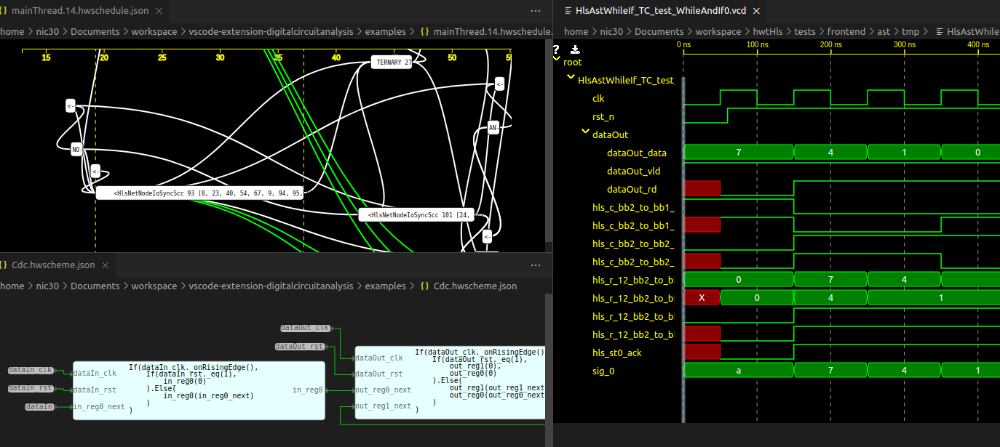

# vscode-extension-digitalcircuitanalysis

This repository contains the Visual Studio Code extension for analysis of digital circuit synthesis process and simulation results.
The main purpose it is debugging and analysis of generated circuits.

## Features

* Views
    * Timeline (gantt) diagram for analysis of operation scheduling based on [d3-hwschedulinggraphs](https://github.com/Nic30/d3-hwschedulinggraphs)
    * Digital wave viewer for Value Change Dump (VCD) files [d3-wave](https://github.com/Nic30/d3-wave)
    * Scheme viewer [d3-hwschematic](https://github.com/Nic30/d3-hwschematic)

* Every view is highly interactive
* Input data format is described in every referenced library 

## Debugging of this extension

- Open this example in VS Code
- `npm install`
- `npm run watch` or `npm run build`
- `F5` to start debugging

### How to debug
* https://dzhavat.github.io/2020/11/12/easy-way-to-debug-a-webview-in-a-vscode-extension.html
   * Ctrl + Shift + P, Open Webview Developer Tools
   * Ctrl + R to reload whole vscode and extension

#### Project template based on:
* https://github.com/microsoft/vscode-extension-samples/tree/main/custom-editor-sample
* https://github.com/inosik/fable-vscode-rollup-sample
* https://code.visualstudio.com/api/working-with-extensions/publishing-extension

   